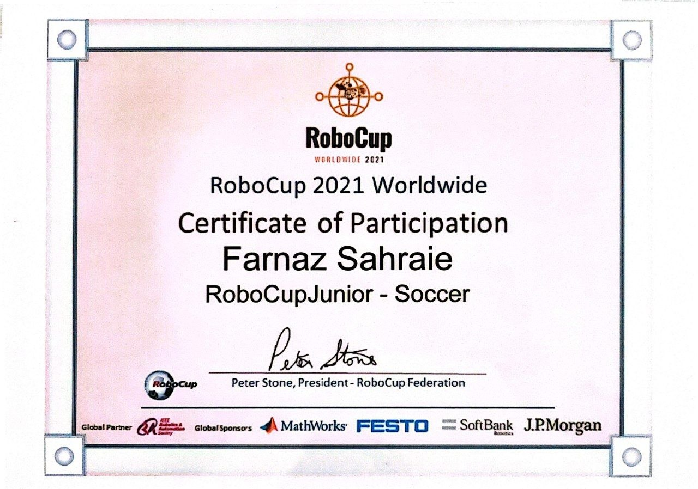
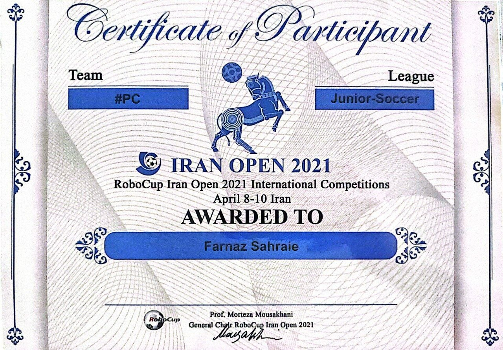

# RoboCup Soccer Robot

## Overview

This project is a real-world autonomous soccer robot developed for participation in the Iran Open RoboCup Competition 2021.

The robot was designed and programmed as an embedded robotic platform capable of autonomous movement, ball detection, and real-time decision making in a competitive soccer environment.

The project focuses on embedded robotics, including omnidirectional motion control, multi-sensor integration, orientation estimation, and real-time firmware development.

---

# Competition Achievement

🏆 **RoboCup 2021 Participant**

🏆 **Iran Open RoboCup 2021 Participant**

This robot was engineered and developed for participation in the Iran Open RoboCup competition.

The project involved designing a complete robotic control system, integrating sensors and actuators, and implementing real-time algorithms for autonomous robot operation.

---

# Project Information

- **Competition:** RoboCup
- **Year:** 2021-2022
- **Category:** Autonomous Soccer Robot
- **Project Type:** Real-world Mobile Robot Platform
- **Controller:** dsPIC33EP128GP506

---

# System Architecture

The robot control system consists of three main layers:

## 1. Sensor Layer

Responsible for collecting information from the environment:

- BNO055 IMU for absolute orientation measurement
- TSSP infrared sensor array for ball direction detection
- NJL sensor for boundary detection
- SRF ultrasonic sensors for distance measurement

---

## 2. Control Layer

Responsible for real-time robot behavior:

- Motor speed calculation
- Direction control
- Heading correction
- Sensor data processing
- Movement command generation

---

## 3. Hardware Layer

Responsible for direct interaction with robot components:

- Microcontroller peripherals
- Motor drivers
- PWM generation
- Communication interfaces

---

# Hardware Platform

## Main Controller

### dsPIC33EP128GP506

A 16-bit Digital Signal Controller used for:

- Real-time control loops
- Sensor communication
- PWM motor control
- Motion calculations

---

# Sensors

## BNO055 IMU

Used for:

- Absolute orientation measurement
- Yaw angle estimation
- Maintaining robot heading during movement

Communication:
- I2C Protocol

---

## TSSP Infrared Sensor Array

Used for:

- Detecting the infrared soccer ball
- Estimating ball direction
- Calculating relative ball angle and distance

---

## NJL Sensor

Used for:

- Detecting field boundaries
- Preventing the robot from leaving the allowed area

---

## SRF Ultrasonic Sensors

Used for:

- Distance measurement
- Obstacle and wall detection

---

# Communication Interfaces

## I2C Communication

Implemented for:

- Sensor data exchange
- Communication with external modules

---

## UART Communication

Used for:

- Debugging
- Real-time monitoring
- System testing

---

# Software Features

## Omnidirectional Motion Control

The robot uses a four-motor omnidirectional drive system.

Implemented features:

- Vector-based movement calculation
- Individual motor velocity control
- Direction and speed adjustment
- Real-time movement correction

---

## Motor Control System

The firmware provides:

- Four-channel hardware PWM generation
- Motor direction control
- Velocity adjustment
- Synchronized motor operation

---

## Ball Detection Algorithm

The robot processes data from the infrared sensor array to estimate:

- Ball angle relative to the robot
- Ball direction
- Approximate distance

The sensor data is converted into movement commands for robot navigation.

---

## Orientation Control

Using IMU feedback, the system performs:

- Heading measurement
- Direction correction
- Rotation error compensation

This allows the robot to maintain a desired orientation while moving.

---

# Technologies

- Embedded C
- CCS C Compiler
- dsPIC Microcontroller Programming
- Hardware PWM Control
- I2C Communication Protocol
- UART Communication Protocol
- Sensor Integration
- Real-Time Embedded Systems
- Mobile Robot Kinematics

---

---

# Engineering Challenges

During development, the main challenges included:

- Real-time sensor data processing
- Synchronizing multiple motors
- Handling hardware limitations
- Reducing sensor noise
- Maintaining stable robot orientation during movement

---

# Demo

Add robot operation videos here:

[▶ Watch Demo Video1](videos/film1.mp4)
[▶ Watch Demo Video2](videos/film2.mp4)
[▶ Watch Demo Video3](videos/film3.mp4)
[▶ Watch Demo Video4](videos/simulation.mp4)

---

# Learning Outcomes

This project provided practical experience in:

- Embedded robotics development
- Autonomous mobile robot control
- Sensor integration
- Real-time firmware design
- Hardware-software integration
- Competitive robotics systems

---

# Author

Developed as a competitive robotics project for Iran Open RoboCup 2021.

This project represents hands-on experience in embedded systems, robotic control, and autonomous mobile robot development.
